채팅방을 개설, 기존의 채팅방에 입장  
모든 채팅 메시지, 데이터를 실시간으로 주고 받음

#### 특이사항

아바타를 선택, 닉네임 직접 입력  
유저가 하나도 없는 채팅방은 한 시간 이후에 자동으로 삭제

스크립트를 통해 HTML 페이지에 채팅방 임베딩 가능 (IFRAME)  
임베딩할 때 파라미터를 통해 입장 할 채팅방을 미리 설정 가능

HTTPS 사용

## 기능 목록

### 관리자 대시보드
### user, 채널, 방
### 메세지
### 활동 데이터

### 로그인

이메일 로그인, 소셜 로그인, 회원가입  
참고: https://okky.kr/article/459448

최초 로그인 --> 소켓 서버 연결

### 회원 가입
### user 대시보드

### 채널 개설
### 채널 목록
### 채널 입장
### 채널 나가기
### 채널 설정

### 방 개설
### 방 목록
### 방 입장
### 방 나가기
### 방 설정

### 메세지 보내기
### 메세지 받기
### 메세지 갱신

## 기타 기능들

### 채팅 창에 자동 포커싱
### 도배 방지
### 채팅창 자동 스크롤

